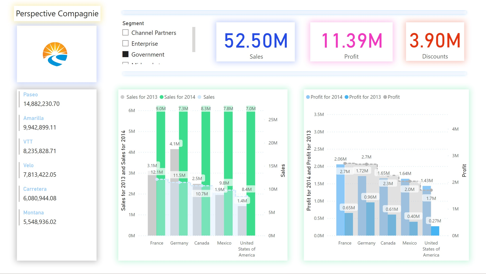
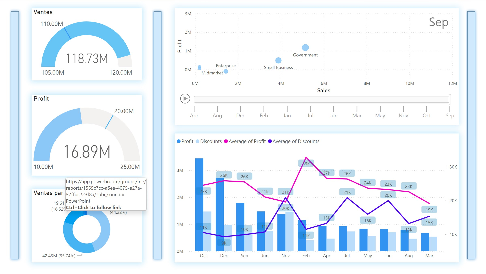
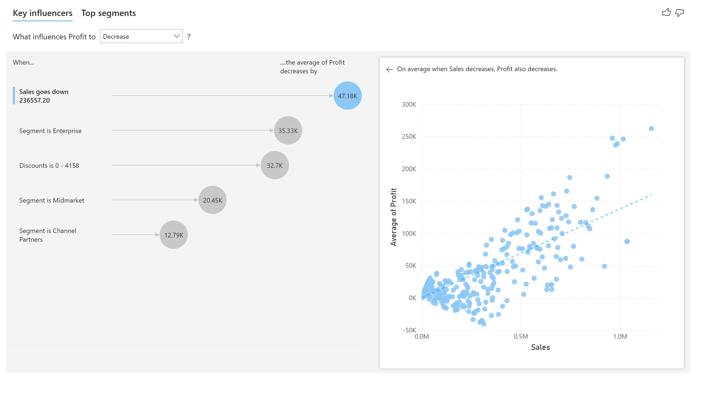

# Perspective-company
 Financial report for Perspective-company design in PowerBI 
 ------------------------------------------------
This project was one that resulted from a search for a pet project (passion project) that would involve working with data that was personal and which the insights would be interesting to see. The documentation includes:
## Database which is locate at Data folder
Click this Data folder to view the data that was been used through the workshop 
## Pictures from Reports
 
 
 

## Link for the Dasheboard and reports
[Perspective Company ](https://app.powerbi.com/reportEmbed?reportId=1555c7cc-a6ea-4075-a27a-57ffbc223f8a&autoAuth=true&ctid=d235b41c-5ee9-4c60-bcff-d68fe3bff6a0)
## Slides
 
[PowerPoint](Financial%20Sample%20PPT.pptx)
